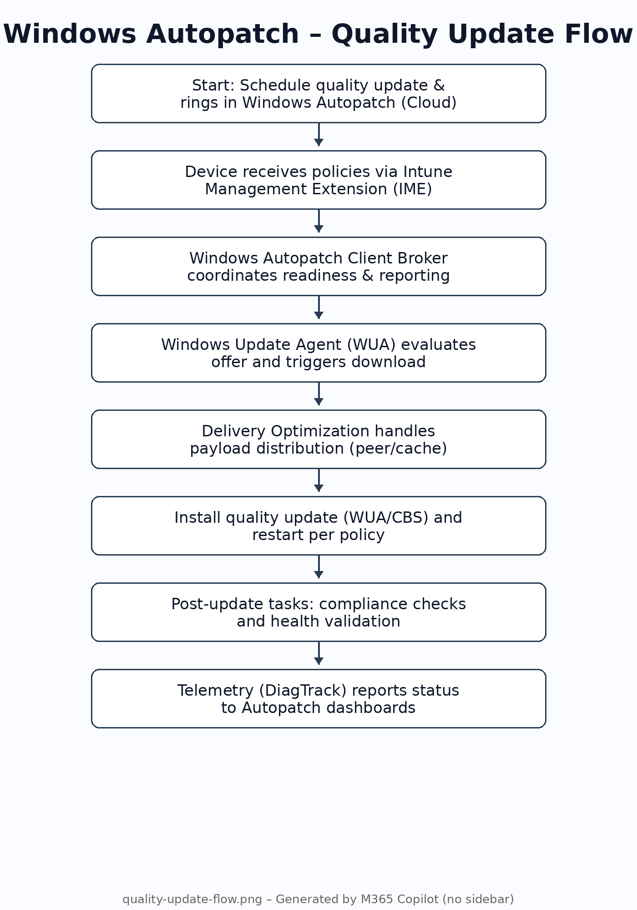
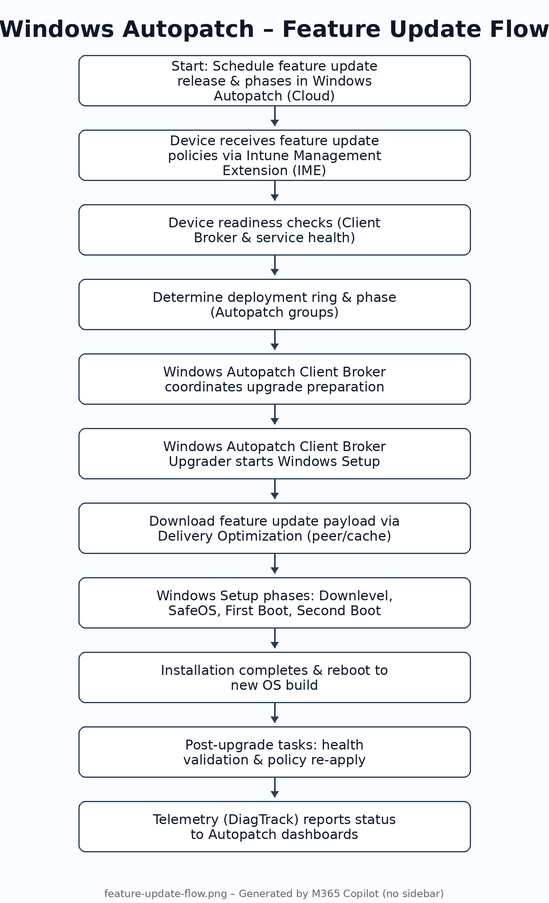

# 🔄 Windows Autopatch

**Technical Documentation & Architecture Guide**

---

## 📋 Overview

Windows Autopatch is a cloud service that automates Windows updates and provides enterprise-grade update management through Microsoft Intune. It orchestrates both quality updates (monthly cumulative updates) and feature updates (OS upgrades) with intelligent ring-based deployments, readiness checks, and automated error handling.

> **🎯 Key Benefits:** Automated patching, ring-based rollouts, built-in safeguards, telemetry-driven decisions, and reduced IT overhead.

---

## 🔧 System Components

### 🤖 Windows Autopatch Client Broker
On-demand agent that performs device readiness checks and automated log collection. Manages communication between devices and Autopatch service. Installed as Win32 app since September 2024.

📚 [Documentation](https://learn.microsoft.com/en-us/windows/deployment/windows-autopatch/operate/windows-autopatch-client-broker)

### ⬆️ Client Broker Upgrader
Invoked for feature upgrade orchestration (setup phases). Handles multi-phase feature releases with ring control during OS upgrades.

📚 [Documentation](https://learn.microsoft.com/en-us/windows/deployment/windows-autopatch/operate/windows-autopatch-feature-update-overview)

### 🔌 Intune Management Extension (IME)
Executes PowerShell scripts and Win32 app-based remediations. Used for readiness scripts and policy conflict remediation.

📚 [Documentation](https://learn.microsoft.com/en-us/mem/intune/apps/intune-management-extension)

### 📋 Windows Update for Business (WUfB)
Controls update policies including offering, deferrals, deadlines, and ring rollout for quality and feature updates.

📚 [Documentation](https://learn.microsoft.com/en-us/windows/deployment/update/waas-manage-updates-wufb)

### 📥 Windows Update Agent (WUA)
System component that downloads and installs update payloads. Handles installation workflows and status recording.

📚 [Documentation](https://learn.microsoft.com/en-us/windows/win32/wua_sdk/portal-client)

### 🌐 Delivery Optimization (DO)
Performs P2P and cache-assisted content distribution to reduce bandwidth during update downloads.

📚 [Documentation](https://learn.microsoft.com/en-us/windows/deployment/do/waas-delivery-optimization)

### 📊 Connected User Experiences & Telemetry
Sends diagnostic/telemetry data used for Autopatch reporting and compliance signals.

📚 [Documentation](https://learn.microsoft.com/en-us/windows/privacy/configure-windows-diagnostic-data-in-your-organization)

### ☁️ Autopatch Service (Cloud)
Cloud orchestration in Intune that manages rings, release schedules, reporting, and readiness checks.

📚 [Documentation](https://learn.microsoft.com/en-us/windows/deployment/windows-autopatch/)

### 🛠️ Windows Setup / SetupDiag
Feature Update only: Setup.exe executes upgrade phases. SetupDiag analyzes failures automatically.

📚 [Documentation](https://learn.microsoft.com/en-us/windows/deployment/upgrade/setupdiag)

> **📝 Note:** LTSC devices are managed for quality updates only; feature updates aren't offered via Autopatch/WU client policies.

---

## 📦 Quality Update Process

Monthly cumulative updates that include security fixes, bug fixes, and improvements. Deployed through ring-based rollouts with automated monitoring.

### Quality Update Flow

```
Autopatch Service 
    ↓
Device Assignment/Rings 
    ↓
IME & Readiness Checks
    ↓
WUA Offer
    ↓
Client Broker Coordinates
    ↓
DO Assists Download
    ↓
Install
    ↓
Telemetry Reporting
```


*You can add your custom diagram here*

### Update Rings

#### 🔵 Test Ring
Initial deployment to pilot devices for validation. Receives updates first (Day 0-1).

#### 🟢 First Ring
Broader deployment after Test ring validation. Typically Day 1-6.

#### 🟡 Fast Ring
Accelerated deployment for early adopters. Day 6+.

#### 🟠 Broad Ring
General deployment to majority of devices. Day 9+.

---

## 🚀 Feature Update Process

Major OS version upgrades (e.g., 22H2 → 24H2) with multi-phase release strategy. Includes comprehensive pre-checks, setup orchestration, and automated rollback capabilities.

### Feature Update Flow

```
Readiness Checks
    ↓
Client Broker Upgrader
    ↓
Windows Setup Phases
    ↓
Downlevel → SafeOS → First Boot → Second Boot
    ↓
Telemetry & Compliance
```


*You can add your custom diagram here*

### Setup Phases

1. **1️⃣ Downlevel Phase** - Pre-installation checks and setup preparation in current OS
2. **2️⃣ SafeOS Phase** - Windows PE environment where OS files are applied
3. **3️⃣ First Boot** - Initial boot into new OS, device configuration begins
4. **4️⃣ Second Boot** - Final configuration and user profile migration

---

## ⚠️ Error Handling & Resolution

### Quality Update Errors

#### ❌ Device Not Ready
- **Detection:** Device Readiness reports show causes
- **Remediation:** IME scripts remove GPO/ConfigMgr conflicts
- **Action:** Ensure recent Intune check-in

#### ❌ Policy Conflicts (WUfB/GPO/ConfigMgr)
- **Detection:** Registry checks for conflicting policies
- **Remediation:** Automated scripts via Intune (IME)
- **Common:** WUServer, UseWUServer, DoNotConnectToWindowsUpdateInternetLocations

#### ❌ Network/Delivery Optimization Issues
- **Fallback:** DO falls back to HTTP source
- **Verify:** Endpoints/ports and proxy bypass for DO service
- **Check:** Firewall rules for DO P2P traffic

#### ❌ WUA Download/Installation Errors
- **Inspect:** WindowsUpdateClient event logs
- **Retry:** Autopatch ring schedule handles retries
- **Pause:** Release can be paused if necessary

### Feature Update Errors

#### ❌ Pre-check/Readiness Failure
- **Causes:** Hardware incompatibility, insufficient storage, BitLocker policy
- **Status:** Autopatch marks device as "Not Ready"
- **Action:** Remediate issues and re-evaluate

#### ❌ Setup Phase Failure
- **Detection:** SetupDiag runs automatically to identify root cause
- **Common Issues:** EFI/system partition conflicts, driver incompatibilities
- **Action:** Review SetupDiagResults.xml and Panther logs

#### ❌ Automatic Rollback
- **Trigger:** Fatal error during setup phases
- **Result:** Windows Setup reverts to previous OS version
- **Analysis:** Review SetupDiag output and retry after fix

#### ❌ Autopatch Pause / Safeguard Holds
- **Reason:** Service pauses rings based on telemetry signals
- **Action:** Hold content until Microsoft publishes mitigations
- **Status:** Monitor release status in Autopatch reports

#### ❌ Support Log Collection
- **Method:** Client Broker enables automated log collection
- **Access:** File support request via Intune's Help & Support
- **Logs:** Comprehensive diagnostics for Microsoft support

---

## 💡 Best Practices for UEM Teams

### ✅ Feature Update Rollouts (24H2+)
- Use multi-phase releases with Device Readiness reports
- Add IME remediation for common blockers (legacy WU settings, storage thresholds)
- Pre-empt failures by addressing readiness issues before deployment

### ✅ Client Broker Deployment
- Deploy tenant-wide as Win32 app for reliable installation
- Verify installation within 30-60 minutes after Autopatch enrollment
- Monitor broker process and service health regularly

### ✅ Policy Conflicts Prevention
- Remove ConfigMgr Software Update client settings for Autopatch devices
- Clear WSUS registry artifacts (WUServer, UseWUServer)
- Implement proactive remediation scripts for drift detection

### ✅ Monitoring & Reporting
- Review Autopatch Device Readiness reports weekly
- Monitor quality and feature update compliance dashboards
- Track error rates and implement targeted remediations

---

## 📚 Additional Resources

### Official Documentation
- [Windows Autopatch Overview](https://learn.microsoft.com/en-us/windows/deployment/windows-autopatch/)
- [Quality Update Management](https://learn.microsoft.com/en-us/windows/deployment/windows-autopatch/operate/windows-autopatch-groups-windows-quality-update-overview)
- [Feature Update Management](https://learn.microsoft.com/en-us/windows/deployment/windows-autopatch/operate/windows-autopatch-feature-update-overview)
- [Conflicting Configurations](https://learn.microsoft.com/en-us/windows/deployment/windows-autopatch/references/windows-autopatch-conflicting-configurations)

### Tools & Scripts
- [Windows Update Fix Repository](https://github.com/roalhelm/WindowsUpdateFix)
- [Proactive Remediation Documentation](https://github.com/roalhelm/WindowsUpdateFix/blob/main/README.md)
- [SetupDiag Tool](https://learn.microsoft.com/en-us/windows/deployment/upgrade/setupdiag)

---

**Created by [Ronny Alhelm](https://github.com/roalhelm)** | [View on GitHub](https://github.com/roalhelm/WindowsUpdateFix)

*Windows Autopatch Technical Documentation © 2025*
- **Easy Navigation** - Jump links to sections

### Modify Colors:

Edit the CSS in `index.html`:
```css
/* Primary color */
background: #0078d4;  /* Change to your color */
```

## 📊 Features

✅ Fully responsive design
✅ Professional Microsoft-style theme
✅ Component cards with hover effects
✅ Error handling documentation
✅ Reference links to official docs
✅ Easy to add images
✅ Mobile-friendly navigation

## 🔗 Links

- **Live Site:** https://roalhelm.github.io/WindowsUpdateFix/
- **Repository:** https://github.com/roalhelm/WindowsUpdateFix
- **Issues:** https://github.com/roalhelm/WindowsUpdateFix/issues
